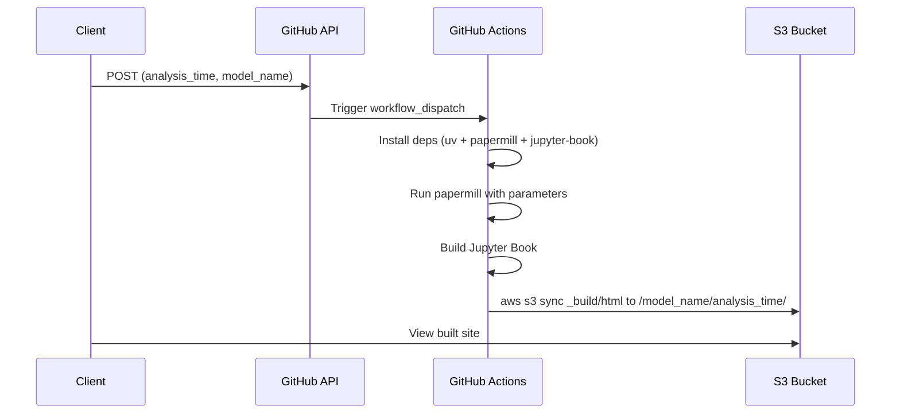

# JupyterBook Automation Flow



## 🔗 URL Reference

- **GitHub API:**  
  `https://api.github.com/repos/<owner>/<repo>/actions/workflows/<workflow_file>/dispatches`

- **GitHub Actions UI:**  
  `https://github.com/<owner>/<repo>/actions`

- **S3 Static Site Example:**  
  `http://<bucket-name>.s3-website-<region>.amazonaws.com/<model_name>/<analysis_time>/index.html`

---

## 🚀 CLI Tool: `trigger_mlverif_build`

This project includes a Python CLI tool to trigger the GitHub Actions workflow that builds and uploads a Jupyter Book based on parameters.

### Usage

```bash
uv run trigger_mlverif_build --model-name <model_name> --analysis-time <ISO8601_timestamp>
```

### Example

```bash
export GITHUB_TOKEN=ghp_abcdef123456
export S3_BUCKET_NAME=my-jupyterbook-bucket
uv run trigger_mlverif_build --model-name my_model --analysis-time 2025-05-05T12:00:00Z
```

---

## ⚙️ Configuration

### 1. Environment Variables

These are required for local development or GitHub Actions. Only `GITHUB_TOKEN` is needed to run the CLI script.

- `GITHUB_TOKEN` (**Required for CLI**)  
  A GitHub personal access token with `repo` and `workflow` scopes.

- `S3_BUCKET_NAME` (**Used in GitHub Actions only**)  
  The S3 bucket to which the Jupyter Book will be uploaded.  
  It is **not required** to trigger the workflow from the CLI.

> ✅ The GitHub Actions workflow will fail if `S3_BUCKET_NAME` is not set in the environment or `.env` file.


In your GitHub repository settings, add the following secrets:

| Secret Name           | Description                                 |
|-----------------------|---------------------------------------------|
| `AWS_ACCESS_KEY_ID`   | AWS key with S3 write access                |
| `AWS_SECRET_ACCESS_KEY` | Corresponding AWS secret key               |
| `S3_BUCKET_NAME`      | (Optional — override via GitHub env instead) |

### 3. Runtime Parameters (CLI or Workflow)

| Parameter       | Description                                |
|-----------------|--------------------------------------------|
| `--model-name`  | Name of the ML model used                  |
| `--analysis-time` | ISO8601 timestamp identifying the analysis |

---

Let me know if you'd like a Jupyter Book page version of this documentation or an auto-validation script.